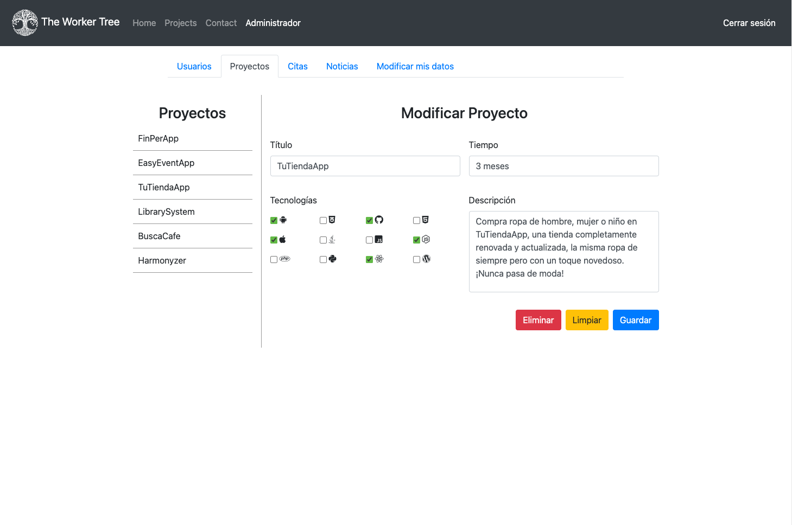

# **The Worker Tree**

  

  
  
  
  
  
  
  

  

Este proyecto forma parte de una de las tareas del <a href="https://www.masterd.es/master-en-programacion-web-y-movil">máster en programación multiplataforma</a> de MasterD.

## **Tabla de contenidos**

- [**The Worker Tree**](#the-worker-tree)
  - [**Tabla de contenidos**](#tabla-de-contenidos)
  - [**Información general**](#información-general)
  - [**Objetivos de la tarea**](#objetivos-de-la-tarea)
  - [**Realización de los objetivos**](#realización-de-los-objetivos)
  - [**Capturas de pantalla**](#capturas-de-pantalla)
  - [**Demo**](#demo)
  - [**Local setup**](#local-setup)
  - [**Conclusiones**](#conclusiones)

## **Información general**

**Fecha**: Enero de 2021. 
**Duración**: 3 meses. 

Esta tarea es la continuación de otra en la que se pedía un sitio web que podía pertenecer a una empresa ficticia o a un portfolio de programador. Los requisitos de dicha tarea eran los siguientes:
- Una página de inicio con una sección de noticias que se cargaban de un archivo JSON.
- Una página de galería donde se mostraban los diferentes proyectos realizados en una galería dinámica.
- Una página de presupuesto en la que el usuario ingresaba los datos referentes al proyecto que deseaba encargar y finalmente se calculaba un presupuesto estimado.
- Una página de contacto que debía incluir un mapa con la posibilidad de mostrar la ruta desde la ubicación del usuario hacia el negocio.

Basándome en esto, realicé la tarea que se muestra en este repositorio cumpliendo con los objetivos que se describen en la siguiente sección.

## **Objetivos de la tarea**

- Una base de datos que contenga las siguientes tablas:
  - Usuarios
  - Clientes(*)
  - Noticias
  - Proyectos
  - Citas
- Una sección de administrador en la que se puedan modificar los datos referentes a los usuarios, proyectos, noticias y citas.
- Una sección de usuario (cliente) en la que se puedan modificar los datos personales y las citas.
- Los usuarios no administradores sólo pueden modificar las citas hasta 72h antes de la misma.
- Las contraseñas para acceder a la sección de usuario deben estar cifradas al menos en SHA256.
- Impedir que se pueda acceder a la sección de usuario si no se está logeado en el sitio web.

(*) La tabla de clientes se puede combinar con la de usuarios añadiendo un campo de rol.

## **Realización de los objetivos**

- Se decidió simplificar el diseño de la base de datos combinando las tablas de Usuarios y Clientes añadiendo el campo de rol.
- Se utilizó _PASSWORD_DEFAULT_ para el cifrado de las contraseñas ya que utiliza por defecto el algoritmo _bcrypt_. Además, el uso de _PASSWORD_DEFAULT_ resulta beneficioso ya que esta constante está diseñada para cambiar siempre que se añada un algoritmo nuevo y más fuerte a PHP. <a href="https://www.php.net/manual/es/function.password-hash.php">Fuente</a>.
- Se añadió la funcionalidad de que un usuario creado desde la sección administrativa tenga la contraseña _"password"_ por defecto.

## **Capturas de pantalla**

<table style="border: none;">
  <tr>
    <td> <i>Página principal</i></td>
    <td> <i>Sección de proyectos</i></td>
  </tr>
  <tr>
    <td> <i>Sección de usuario</i></td>
    <td> <i>Sección administrativa</i></td>
  </tr>
</table>

## **Demo**

 <a href="https://theworkertree.herokuapp.com/">The Worker Tree</a>

Usuarios de prueba:

- 
admin@admin.com -- <i>admin123</i>

- 
lola@user.com -- <i>lola123</i>

_La base de datos restablece los valores por defecto a diario a las 6:30 am UTC._

## **Local setup**

- Clonar este repositorio
- Crear una base de datos y acceder a ésta desde un gestor de bases de datos como PhpMyAdmin, DBeaver...
- Utilizar el contenido del archivo _init_db.sql_ para inicializar la base de datos

## **Conclusiones**

- Podría haber incluido algún framework que permita tener un código más limpio y ordenado, pero en su momento preferí hacerlo prescindiendo de ello para aprender bien las bases de php.
- En el futuro me gustaría replicar este proyecto en Java + VueJS para aplicar lo que he aprendido los últimos meses y añadiendo algunas mejoras como:
  - Insertar, actualizar o borrar imágenes del servidor (sección de administrador)
  - Autenticación de usuario con token y mayor cifrado de contraseñas.
  - Mejorar el diseño: hacerlo más dinámico, responsive, una mejor elección de colores, logo, imágenes...
